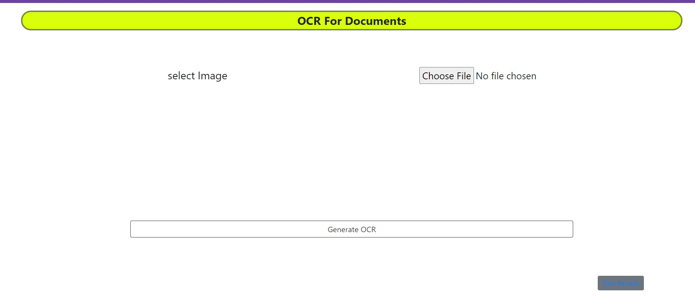
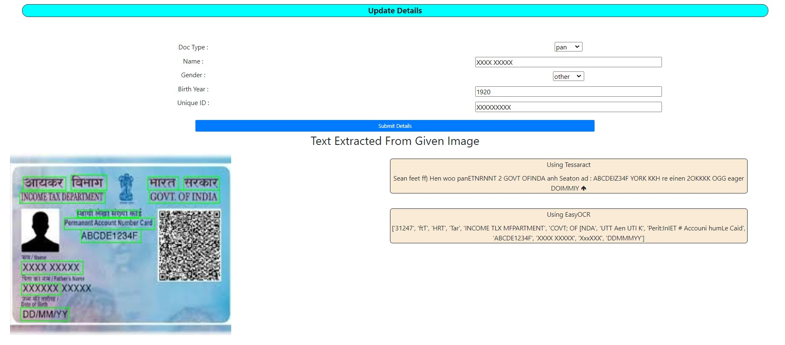
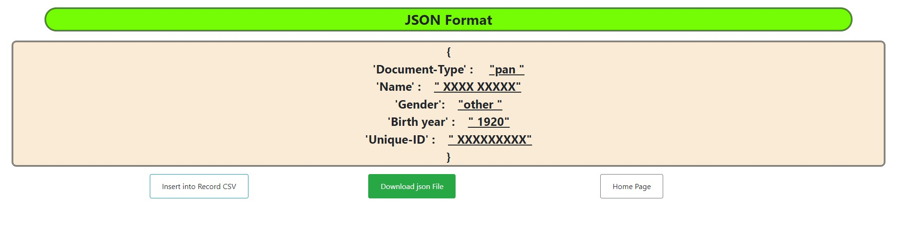
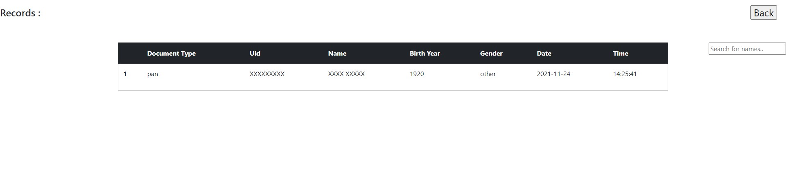

<h1 align="center">Document-Image-Analysis</h1>

_Document Image analysis using OCR methods ._
For more info , watch => [PPT](https://silentlad.com)
---

softawre Requirements : 
  1] Python 3.7.3
  2] Pytesseract

# Gui Screenshots

  Home Page to select Image

   confirm and update extraced information from ocr

   convert to JSON Fromat and also downlaod json option is available

   Records of ocr extractred information

# Installation

`pip install requirements.txt`    
`python app.py`    

## Usage

to extract text from image    
make meaning document file using extracted text   
maintain record of documents  
make json from document for further use 

